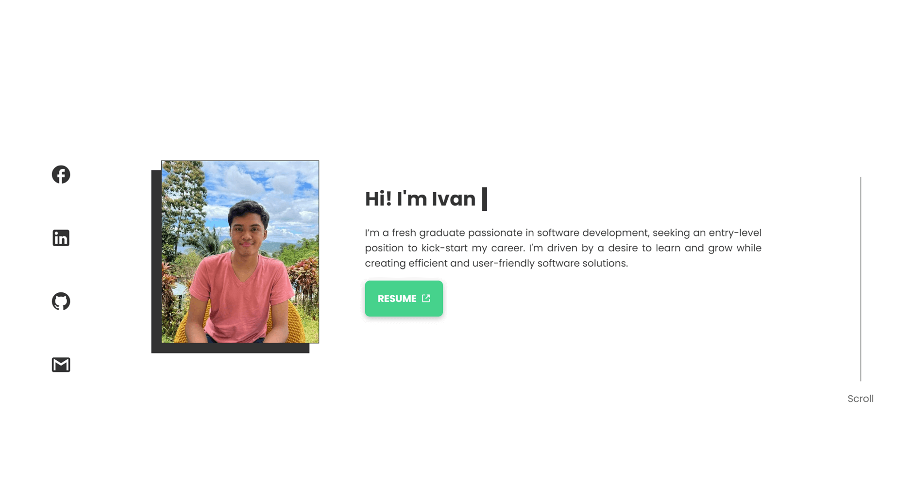
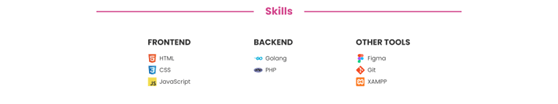
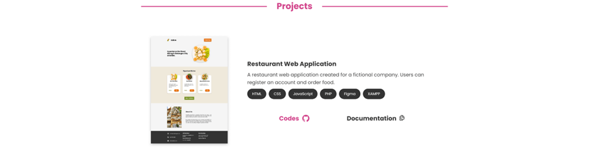

# Design

Design is a crucial aspect of any web project, it determines how well the viewers can navigate and maintain interest in the content. 

A portfolio website often reflects the designer's personality. While creating mine, I considered not only my design preferences but also the expectations of recruiters and general viewers. It's essential to strike a balance between creativity and usability—ensuring that viewers don't leave due to complexity or lack of engagement. We want the viewers to explore the website up to the very last content.  

## Color Pallete

| **Color**      | **Hex** | **Preview**                                                                                       |
|----------------|---------|---------------------------------------------------------------------------------------------------|
| White          | #FFF    | 

 |
| Dark Charcoal  | #333    | 

 |
| Pink (Pantone) | #D2468C | 

 |
| Ocean Green    | #46D28C | 

 |

White and Black are used in most websites as a necessary part of pallettes. Dark Charcoal is used rather than Black to provide a softer and more comfortable reading experience.

Pink is my favorite color and I found pantone the best pink to fit a white background so it is used as the primary color. 

Ocean Green is used as the secondary color because it complements the pink color. 

## Typography

| **Category** | **Details**            |
|--------------|------------------------|
| Font Family  | Poppins, sans-serif    |               |
| Font Sizes   | 32px, 28px, 22px, 16px |

Poppins was chosen for its clean and modern look, with Sans-Serif as the fallback.

To maintain a simple design, I limited the font sizes to the default size and three additional sizes.

## Page Layout

### Full Page - Desktop

In creating my portfolio, I aimed for a balance between aesthetics and simplicity. The goal was to create a visually pleasing experience without overwhelming the viewer. Every component has a purpose, and unnecessary details were avoided.

**Background**

The white background is used for simplicity and clean look.

**Sections**

It is important for websites sections to be visually distinct from each other to separate ideas so I used lines and titles to divide each sections. Vertical padding is applied to each section to enhance readability. 

I have maximized the amount of sections to only 4 which are the about, skills, experience, and projects compared to the typical web portfolios that include services and contact section which in my case is unnecessary. By focusing on essential content, the site minimizes unnecessary information and caters to the shorter attention spans of modern users.

**Content Width**

I chose a content width of 1000px to ensure optimal readability on larger screens. By keeping the content width narrower, it prevents the text from spanning too wide, making it easier for viewers to read and follow along without straining their eyes.  It also makes it easier to translate the design to mobile devices.

**Social Links**

Social links are fixed in position on the left side of the page, making it easy for viewers to find contact options without scrolling. This design choice improves accessibility and user convenience.

**Balance**

Each content is spread to the edge of the content containers and the contents are aligned and spaced evenly giving it a visually pleasing balance. 

**Links**

Links are set to open in new tabs to prevent users from losing interest or needing to reload the portfolio site. Documents such as resumes are also opened in new tabs to avoid forcing downloads, which could potentially annoy or intimidate users, especially those who are less tech-savvy as they might get the idea that the file may be malicious. 

**Entrance Animations**

It adds a touch of interactivity and helps to capture the viewer's attention as they scroll through the site, leaving a lasting impression. 

### Home Section

By having the home page cover the entire screen, it creates an immersive and impactful first impression.

**Greetings**

"Animating 'Hi, I'm Ivan' with a typing effect creates the illusion of a personal conversation, making the experience more engaging and immersive for the viewer."

**Profile Border**

The profile border when hovered or clicked, goes through each color in the color pallette except white giving vieweres something to entertain them.

**Scroll Tip**

The scroll tip appears on the right when the viewer stays in the home section too long, this avoids scenarios where the viewer doesn't realize that there are more sections and the website can be scrolled.

### Skills Section

By including recognizable icons breaks up the text-heavy sections makes the content more engaging and easier to scan.

### Experience Section

Company names and lesser-known technologies are hyperlinked for viewers who may want to explore further.

### Projects Section

### Footer 

A simple black background spanning to the ends of the screen is simple but visually appealing enough so i think its fine as it is. 

## Responsiveness

Making sure the website works well on all devices is important so that anyone can view it comfortably. 

{: style="height:auto;width:300px"}

Font and container sizes are adjusted to fit the screen appropriately. 

Padding on the left and right ensures content remains readable.

The scroll tip is removed as it no longer fits the design.

Social Links are moved to the footer as it is normally the place where contact information is located.

